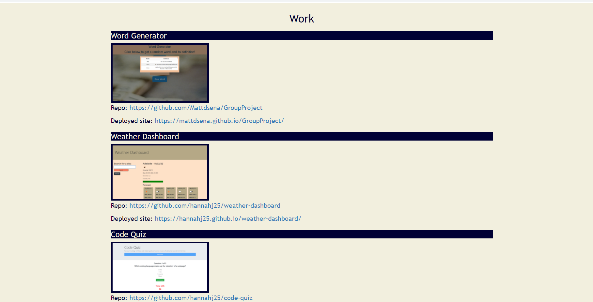

# PORTFOLIO

## Purpose

The goal of this project is to establish a simple portfolio webpage that I can utitlise to showcase other projects/work.

## Specifications

The main elements of the page are: 

   Name and photo/avatar 

   A brief introduction/about me

   A section wherein titled projects and their links are displayed
   
   A section with contact information

The code is structured with links scrolling to each section and uses a responsive layout that can be easily viewed on different screen sizes.

## Screenshot

## Link

https://hannahj25.github.io/portfolio-hannah/